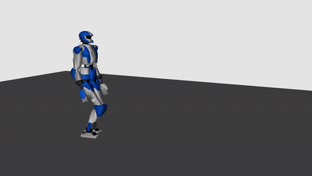

# Project Development
The following repo was used as the starting point for the development of the project for Underactuated Robots course.

# Description
This is IS-MPC, a framework for humanoid gait generation.

The main reference is:<br />
[N. Scianca, D. De Simone, L. Lanari, G. Oriolo, "MPC for Humanoid Gait Generation: Stability and Feasibility"](https://ieeexplore.ieee.org/document/8955951)<br />
*Transactions on Robotics*, 2020

The extension available in this repository uses the 3D LIP and can also generate vertical motions. Main reference:<br />
[M. Cipriano, P. Ferrari, N. Scianca, L. Lanari, G. Oriolo, "Humanoid motion generation in a world of stairs"](https://www.sciencedirect.com/science/article/pii/S0921889023001343)<br />
*Robotics and Autonomous Systems*, 2023

To this framework, a novel balancing technique based on Capture Points was added. The newest control is comprised of both the MPC previously defined and the new control. Main reference:<br />
[Mitsuharu Morisawa, Shuuji Kajita, Fumio Kanehiro, Kenji Kaneko, Kanako Miura, Kazuhiro Yokoi, "Balance Control based on Capture Point Error Compensation for Biped Walking on Uneven Terrain"](https://ieeexplore.ieee.org/stamp/stamp.jsp?tp=&arnumber=6651601)<br />

# Demo
The **plain** configuration (IS-MPC + capture-point feedback + ZMP feedback) walking ~2.2 m:



Full-resolution recordings live in `logs/videos/` (1280x720, 25 fps, 1x real time):
`plain.mp4`, `ISMPC-no-cp.mp4` and `CP-controller.mp4`. See
[Simulation videos](#simulation-videos) to regenerate them.

# Setup
You need a Python installation and some dependencis. If using pip, you can run the following
```
pip install dartpy casadi scipy matplotlib osqp
```
You need dartpy 0.2, if pip does not allow you to install this version on your system, you probably need to upgrade to Python 3.12 or use conda

To run the simulation
```
python simulation.py
```
then press spacebar to start it

You can disable the Kalman Filter by executing:
```
python simulation.py --no-kf
```

After executing the simulation, you can generate the plots by running
```
python plot_logs.py logs/log.npz
```

# Reproducing the results
All numbers in `runs_summary.md` and every ablation plot under `logs/` are produced by two **headless** drivers — no GUI window and no spacebar needed. Use the same environment as the interactive sim (the runs in `runs_summary.md` were produced with Python 3.14, `dartpy` 6.16). Activate it first, then run the commands below from the repository root.

> **Note on determinism.** The simulation contains no random number generator, yet results wobble slightly run-to-run. The spread is small — under ~0.02 mm on the ZMP RMSE, up to ~0.5° peak-to-peak on waist pitch and ~10 N on peak Fz, with COM and ZMP-y essentially unaffected — and the run effectively clusters between two nearly-identical outcomes, so a single run is representative and no averaging is needed. The wobble originates in the numerical pipeline (multithreaded BLAS floating-point reductions plus the DART/OSQP solvers): a sub-ULP difference occasionally tips a near-threshold contact/QP event one way or the other. Pinning the BLAS thread count,
> ```
> OMP_NUM_THREADS=1 OPENBLAS_NUM_THREADS=1 MKL_NUM_THREADS=1 python simulation.py
> ```
> shrinks the wobble but does **not** fully remove it — we did not find a single switch that makes runs bit-for-bit reproducible. The same prefix works for `ablation_poles.py` and `make_runs_summary.py`.

## Summary table (`runs_summary.md`)
The table has two parts: an 8-row configuration comparison (re-simulated every time) and the ablation rows (read from a cached `raw_runs.pkl`). Regenerate the cache first, then build the table:
```
python ablation_poles.py       # 26 headless sims -> logs/ablation_poles/raw_runs.pkl (+ ablation plots)
python make_runs_summary.py    # 8 headless config sims + reads the cache -> runs_summary.md
```
Rerun `ablation_poles.py` before `make_runs_summary.py` whenever a change touches the controller, otherwise the ablation rows keep their stale cached values. `make_runs_summary.py` on its own only refreshes the configuration-comparison rows.

## Pole / g_p ablation plots
`ablation_poles.py` sweeps each CP-feedback pole (`alpha`, `beta`, `gamma`) and the ZMP-lag gain `g_p` one at a time about its default, writing per-axis error plots into `logs/ablation_poles/`:
```
python ablation_poles.py           # default (lagless) plant
python ablation_poles.py --lag     # same sweep on the ZMP-lag plant -> logs/ablation_poles_lag/
python ablation_poles.py --replot  # rebuild plots from the cached raw runs (no re-simulation)
```

## Individual configurations (interactive, with viewer)
Each row of the configuration table is one flag combination of `simulation.py`. To watch a single config in the DART viewer (press spacebar to start), run:

| config | command |
|---|---|
| plain (ISMPC + CP + ZMP feedback) | `python simulation.py` |
| ISMPC, no capture point | `python simulation.py --no-cp` |
| no ZMP feedback | `python simulation.py --no-zmp-fb` |
| ZMP-lag plant | `python simulation.py --lag` |
| open-loop MPC | `python simulation.py --open-loop` |
| CP feedback controller (no MPC) | `python simulation.py --no-mpc` |
| CP controller, no ZMP feedback | `python simulation.py --no-mpc --no-zmp-fb` |
| CP controller, ZMP-lag plant | `python simulation.py --no-mpc --lag` |

Append `--no-kf` to any of these to disable the Kalman filter. Each run writes `logs/log<suffix>.npz` and, unless `--no-plot` is given, saves the per-run plots into `logs/log<suffix>/`.

## Simulation videos
`record_videos.py` records an MP4 per configuration into `logs/videos/`, named with the
same slugs as `logs/zmp_plots/`:
```
python record_videos.py                        # ISMPC (no cp), plain, CP controller
python record_videos.py plain CP-controller    # a chosen subset
python record_videos.py --benchmark            # check the renderer sustains the target fps
```
It needs `ffmpeg` and `Xvfb` (`sudo dnf install -y xorg-x11-server-Xvfb`). dartpy's own
`Viewer.record()` cannot be used: the wheel bundles the OSG core libraries but none of the
`osgdb_*` image plugins, so OSG has no encoder to write frames with. Instead each run is
rendered onto a private Xvfb display and captured with ffmpeg's `x11grab`, so nothing
appears on -- or is recorded from -- the real desktop. Stepping is driven manually rather
than through `viewer.run()`, so a run ends with the footstep plan instead of waiting for a
window to be closed, and it is paced to wall-clock time (`stride * fps * dt == 1`) so the
video plays at 1x.

# Block Diagram
The complete block diagram is shown below. Some modifications that were tested were to delete feedback to MPC and passage through Kalman Filter, but this is the most complete diagram.

                                 _________________________________________________
                                |                     PLANNING                    |
                                |  +-------------------+    +------------------+  |
                                |  | Footstep Planner  |--->| Foot Traj. Gen.  |  |
                                |  +-------------------+    +------------------+  |
                                |___________|_________________________|___________|
                                            |                         |
               (ZMP midpoints)              |                         | (Foot Pos/Vel/Acc)
      ______________________________________V_________________________|___________
     |                                                                |           |
     |   Control MPC & Balance (ismpc.py)                             |           |
     |                                                                |           |
     |   +-----------+          +-------------------------+           |           |
     |   |    MPC    |--p_ref-->|   CP-ZMP BALANCE        |           |           |
     |   | (Optimal) |--xi_ref->|   CONTROL (Eq. 21)      |           |           |
     |   +-----------+          +-------------------------+           |           |
     |         ^                        (Feedback) |                  |           |
     |_________|___________________________________|__________________|___________|
               |                                   |                  |
               |                                   | p_cmd            | (Desired State)
               | (State Estimate)                  V                  V
      _________|__________________________________________________________________
     |         |                                                                  |
     |         |                             +---------------------------+        |
     |         |                             |                           |        |
     |   +-------------------+               |     INVERSE DYNAMICS      |        |
     |   |   Kalman Filter   |---(x_flt)---->|        (id.py)            |        |
     |   +-------------------+               |                           |        |
     |_________^_____________________________|____________|______________|________|
               |                                          |
               | (Raw Sensors: COM, ZMP_meas)             | (Joint Torques: tau)
      _________|__________________________________________|_______________________
     |         |                                          |                       |
     |         |                                          V                       |
     |         |                             +----------------------------+       |
     |         |                             |       ROBOT (HRP-4)        |       |
     |         +-----------------------------|       (DART Engine)        |       |
     |                                       +----------------------------+       |
     |____________________________________________________________________________|
